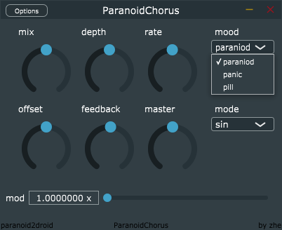
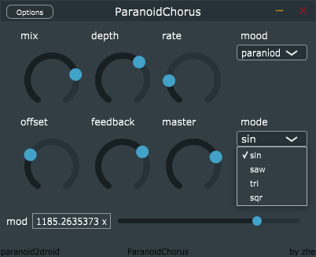

# ParanoidChorus

A chorus-like effect based on JUCE

**See video demo [here](https://youtu.be/ECDHRS1kips).**

## General Parameters

Knobs on the top-left are basically parameters you can modify on a delay/chorus/flanger effect.
Play with them!

## Mood Selection

You can choose different "mood" in the mood combo box.

We offer 3 kinds of moods:

* paranoid
* panic
* pill

corresponding to different levels of modulating. 
Try 'em out!

## Mode Selection

You can choose different "mode" in the mode combo box.

We offer 4 kinds of modes:

* sin
* saw
* tri
* sqr

corresponding to different functions of oscillator. 
Try 'em out!

## Mod Slider

You can push the mod pusher on the bottom.
That works like a rocket booster for the LFO.
Try 'em out! (and be careful

-------

## Building

So far I've only built under Windows. For use as standalone application or VST3, you can download my release version.
You need to build by yourself using JUCE if you want to compile an AU version, or to modify the codes.
Simply Download Juce (http://www.juce.com/) and import the project via Projucer.
Feel free to play!

